# ACARS Viewer
28.01.2026

---

## Giriş:

Havacılık Data Link iletilerinin görüntülenmesi için web tabanlı uç yazılım. Hem canlı iletileri gerçek zamanlı olarak takip etmeye hem de geçmiş iletileri filtreleyip incelemeye olanak sağlar.

Ibosoft ATC sistemi içerisinde bu yazılım kullanılmaktadır. https://atc.ibosoft.net.tr

Yazılımın çalışabilmesi için arka yazılımla (ACARS Backend) birlikte kullanılmalıdır.

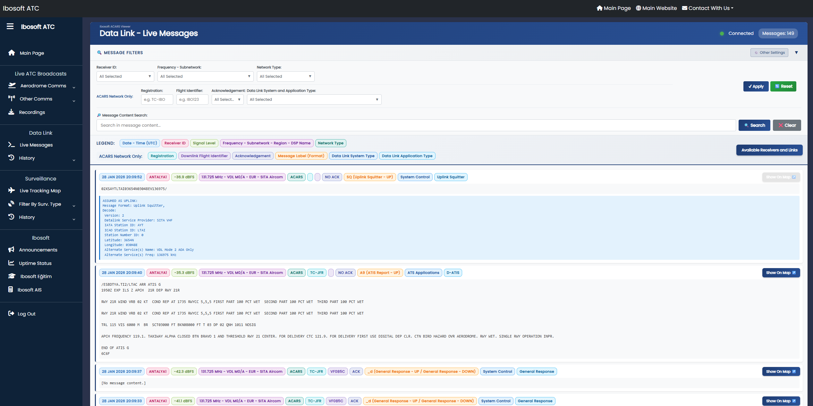

**Özellikler:**
* Web tabanlı arayüz (PHP)
* Canlı ileti takibi (SSE ile)
* Geçmiş ileti görüntüleme ve filtreleme (Veri tabanı üzerinden)
* ICAO SARP'ları ve ARINC kılavuzlarına uygun olarak kullanılmış terimler.
* İletilere göre Alıcı Kimliği, Kanal (Frekans), Network (ACARS/ATN) ve Subnetwork (VDL M0/A, VDL M2, HFDL, INMARSAT Classic Aero) ayrımı, filtreleme ve etiketleme
* ACARS ileti çözümlemesi (ARINC 620/622)
* ARINC 620/ICAO Doc 10037'ye göre Data Link Application / Label esaslı filtreleme ve etiketleme
* ARINC 618 Aircraft Address / Flight Identifier esaslı filtreleme ve etiketleme
* Tarih, zaman ve sinyal seviyesi bilgileri.
* tar1090 tabanlı uçak takip haritası entegrasyonu

>**NOT:** ATN ağı ile alakalı bazı kod parçaları ve özellikler eklenmiştir fakat henüz ATN ağı desteği tamamlanmamıştır. Sadece ACARS ağı desteklenmektedir.  
>**NOT 2:** Yazılım henüz sadece VDL M0/A subnetwork'ü ile test edilmiştir. Diğer subnetwork türleriyle test edilmemiştir ve ayrım sorunları oluşabilir. İmkanlar oluşunca diğer subnetwork türleriyle de test edilip uyumluluk sağlanacaktır.  
>**NOT 3:** Henüz CPDLC kullanılan bir bölgede besleyicimiz bulunmadığı için ACARS ağı üzerinden CPDLC uygulaması (data link application) test edilememiştir.  
>**NOT 4:** ARINC 620 kapsamındaki iletilerin çözümlenmesinde kullanılan Ibosoft ACARS Decoding Library henüz tamamlanmadığından tüm iletiler çözülememektedir. Kütüphane tamamlandıkça desteklenen ileti türleri artırılacaktır.

**İleride Düşünülen Özellikler:**
* ADS-C ve WPR uygulamalarından elde edilen konum verilerinin hazır readsb yazılımına veya ileride yapmayı planladığımız gözetim yazılımına gönderilmesi. (Diğer Downlink biçimlerinden konum verisi elde etmek için acars2pos yazılımını kullanabilirsiniz.)
* VDL M2 subnetwork'ü üzerinden ATN ağı (network) desteği ve ATN B1 sistem türü (data link system type) desteği ve ATN B1 üzerinden CPDLC uygulaması (data link application) desteği.

**Data Link Yazılımlarımız:**
* ACARS Viewer
* ACARS Backend
* ACARS Decoding Library
* ACARS Tester

> Havacılık iletişim ve data link sistemleri hakkında daha fazla bilgi için: https://egitim.ibosoft.net.tr/  
> Projede kullanılan kısaltmalar için bakınız: [Ibosoft Kısaltmalar Veri Tabanı](https://egitim.ibosoft.net.tr/abbreviations-database/)

**Lisans:**

Bu proje **Elastic License 2.0** ile lisanslanmıştır.

Kaynak kodu herkese açıktır. Kişisel ve ticari projelerde kullanım
serbesttir. Kod üzerinde değişiklik yapılabilir; ancak projenin
kendisi veya değiştirilmiş hâlleri, açık izin alınmadan yeniden
paylaşılamaz, yayımlanamaz veya bir servis olarak sunulamaz.

---

## Introduction:

Web-based client software for viewing aviation Data Link messages. It allows both real-time tracking of live messages and filtering/reviewing historical messages.

This software is used within the Ibosoft ATC system. https://atc.ibosoft.net.tr

The software must be used together with the backend software (ACARS Backend) to function.


**Features:**
* Web-based interface (PHP)
* Live message tracking (via SSE)
* Historical message viewing and filtering (via database)
* Terms used in accordance with ICAO SARPs and ARINC manuals
* Receiver ID, Channel (Frequency), Network (ACARS/ATN) and Subnetwork (VDL M0/A, VDL M2, HFDL, INMARSAT Classic Aero) distinction, filtering and tagging based on messages
* ACARS message decoding (ARINC 620/622)
* Data Link Application / Label-based filtering and tagging according to ARINC 620/ICAO Doc 10037
* ARINC 618 Aircraft Address / Flight Identifier based filtering and tagging
* Date, time and signal level information
* tar1090-based aircraft tracking map integration

>**NOTE:** Some code fragments and features related to the ATN network have been added, but ATN network support has not yet been completed. Only the ACARS network is supported.  
>**NOTE 2:** The software has currently only been tested with VDL M0/A subnetwork. It has not been tested with other subnetwork types and distinction issues may occur. As opportunities arise, it will be tested with other subnetwork types and compatibility will be ensured.  
>**NOTE 3:** Since we do not yet have a feeder in a region where CPDLC is used, the CPDLC application (data link application) over the ACARS network could not be tested.  
>**NOTE 4:** Since the Ibosoft ACARS Decoding Library used in decoding messages within the scope of ARINC 620 has not yet been completed, not all messages can be decoded. As the library is completed, supported message types will be increased.

**Future Features:**
* Sending location data obtained from ADS-C and WPR applications to ready-made readsb software or surveillance software we plan to make in the future. (You can use acars2pos software to obtain location data from other Downlink formats.)
* ATN network support via VDL M2 subnetwork and ATN B1 system type (data link system type) support and CPDLC application (data link application) support via ATN B1.

**Our Data Link Software:**
* ACARS Viewer
* ACARS Backend
* ACARS Decoding Library
* ACARS Tester

> For more information about aviation communication and data link systems: https://egitim.ibosoft.net.tr/  
> For abbreviations used in the project, see: [Ibosoft Abbreviations Database](https://egitim.ibosoft.net.tr/abbreviations-database/)

**License:**

This project is licensed under **Elastic License 2.0**.

The source code is open to everyone. Use in personal and commercial projects
is free. Modifications can be made to the code; however,
the project itself or modified versions cannot be redistributed,
published, or offered as a service without explicit permission.

---

# TÜRKÇE KISIM


## Kurulum ve Çalıştırma:

### Gereklilikler:
- Web sunucusu (Apache, Nginx, IIS vb.)
- PHP 8.x
- Ibosoft ACARS Backend yazılımı
- Ibosoft ACARS Decoding Library
- MySQL tabanlı veri tabanına erişim (Geçmiş iletiler için.)

---

### Kurulum:

Bu yazılım PHP modülü olarak tasarlanmıştır ve mevcut bir web sitesine entegre edilmesi gerekmektedir. Kendi istediğiniz bir şekilde web sitesi oluşturup web sitenizde uygun bir sayfaya çağırabilirsiniz. Aşağıda bazı örnek adımlar verilmiştir:

1. **Dosya Yerleştirme**: Web sunucunuzdaki sitenizin dizininde, Data Link görüntüleme sayfası için oluşturduğunuz bir alt dizine tüm dosyaları yükleyin.

2. **ACARS Decoding Library'nin Eklenmesi**: Ibosoft ACARS Decoding Library'nin en son sürümünü indirip, bu projenin dizinine `acars-decoding-library` adlı bir klasör içerisinde yerleştiriniz.

3. **Site Entegrasyonu**: Ana sitenizden ACARS Viewer'ı çağırmak için basit bir index.php örneği:

```php
<?php
// Basit index.php örneği
?>
<!DOCTYPE html>
<html>
<head>
    // Sayfa başlık bilgileri
</head>
<body>
    <?php include 'page-data-link.php'; ?>
</body>
</html>
```

4. **Veritabanı Yapılandırması**: Geçmiş ileti modunda geçmiş iletiler doğrudan veri tabanından alınmaktadır. Arka yazılımın kayıt aldığı veri tabanı kullanılmalıdır. Veri tabanı bağlantı bilgileri environment variable olarak alınır. Aşağıdaki yöntemlerden birini kullanabilirsiniz:

**Yöntem A - PHP içinden ayarlama:**
```php
<?php
// config-local.php dosyası oluşturun
putenv('DB_HOST=localhost');
putenv('DB_PORT=3306');
putenv('DB_NAME=acars_database');
putenv('DB_USER=username');
putenv('DB_PASS=password');

// Ana sayfanızın başında bu dosyayı include edin
include 'config-local.php';
include 'page-data-link.php';
?>
```

**Yöntem B - Apache .htaccess üzerinden ayarlama:**
```apache
# .htaccess dosyası
SetEnv DB_HOST "localhost"
SetEnv DB_PORT "3306"
SetEnv DB_NAME "acars_database"
SetEnv DB_USER "username"
SetEnv DB_PASS "password"
```

5. **Backend Ayarları**: Arka yazılımın README dosyasında belirtilen ayarlamaları yapınız, uç yazılımdaki arka yazılım ile alakalı ayarlamaları uyumlu şekilde yapınız.

6. **Web Sunucu Kontrolü**: PHP modülünün etkin olduğundan emin olun

---

### Çalıştırma:
Tarayıcınızda, sitenizin içinde bu modülü çağıran sayfaya giriş yaptığınızda ACARS Viewer arayüzü açılacaktır.

---

## Ayarlamalar:

### Backend Bağlantısı:
`data-link-config.php` dosyasındaki bağlantı ayarlarını arka yazılımın ayarlarına göre yapılandırın:

```php
// API URL'leri
define('DATALINK_API_HOST', 'dlink-api.ibosoft.net.tr'); // Arka yazılımın API host adı/IP'si
define('DATALINK_API_PORT', 2053); // Arka yazılımın API port numarası
define('DATALINK_API_BASE_URL', 'https://' . DATALINK_API_HOST . ':' . DATALINK_API_PORT); // http/https ayarı
```

---

### Gözetim Haritası Entegrasyonu:
Uçak takibi haritası (tar1090) entegrasyonu için gerekli URL ayarları. ACARS iletilerinde Aircraft Address bilgisi bir kuyruk numarası içeriyorsa URL'nin sonuna uygun tar1090 query string'leri yazılım tarafından eklenir ve iletinin kenarında tıklanabilir bir buton çıkar.

**Canlı Mod İçin:**
```php
// Canlı modda surveillance map URL'i
define('SURVEILLANCE_MAP_BASE_URL', 'https://atc.ibosoft.net.tr/surveillance/');
define('SURVEILLANCE_MAP_URL_QUERY', '?reg={REG}&noIsolation');
```

**Geçmiş Mod İçin:**
```php
// Geçmiş modda surveillance map URL'i  
define('SURVEILLANCE_MAP_BASE_URL_HISTORY', 'https://atc.ibosoft.net.tr/surveillance/');
define('SURVEILLANCE_MAP_URL_QUERY_HISTORY', '?reg={REG}&showTrace={DATE}&timestamp={TIMESTAMP}&zoom=7.5');
```

**Placeholder Açıklaması:**
- `{REG}`: Uçak tescil kodu (tire işaretleri kaldırılmış halde)
- `{DATE}`: Tarih bilgisi (Y-m-d formatında UTC)  
- `{TIMESTAMP}`: Unix timestamp formatında zaman bilgisi

**Oluşturulacak URL Örnekleri:**
- Canlı mod: `https://atc.ibosoft.net.tr/surveillance/?reg=TCOHF&noIsolation`
- Geçmiş mod: `https://atc.ibosoft.net.tr/surveillance/?reg=TCOHF&showTrace=2026-01-28&timestamp=1769637420&zoom=7.5`

---

### Varsayılan Filtre Ayarları:
Sayfa yüklendiğinde hangi label'ların seçili olacağını belirler:
* true: Tüm Label'lar seçili
* false: _DEL ve SQ Label'lar hariç tüm Label'lar seçili (bu iki Label'e sahip ACARS ileti biçimleri çok sık kullanılır ve işlevsel bir bilgi sağlamazlar. O yüzden ilk yüklenmeden bunların seçilmemiş olmasını isteyebilirsiniz.)

Örneğin, canlı modda canlılık takibi için tüm label'ların seçili ayarlayabilir; ancak geçmiş modda doğrudan daha işlevsel iletileri listelemek için bu iki label hariç tüm label'ların seçili olması tercih edilebilir.

```php
// Varsayılan Filtre Ayarları
define('DEFAULT_SELECT_ALL_LABELS_LIVE', true);     // Canlı mod: TÜM label'lar seçili
define('DEFAULT_SELECT_ALL_LABELS_HISTORY', false);  // Geçmiş mod: _DEL ve SQ hariç TÜM label'lar seçili
```

---

### Receiver ve Kanal Ayarları:

**Receiver Listesi (`data/receiver-list.php`)**  
Bu dosya filtreleme ve etiketlemede kullanılır. Kullanıcının data link altyapısına göre alıcı kimlikleri ayarlanmalıdır. Liste dışında bir alıcı kimliği gönderilirse, alıcı kimliği doğrudan gösterilir. Filtrelemede Other (Diğer) seçeneği ile tüm liste dışı alıcılar gösterilir.

```php
// Örnek alıcı listesi
<?php
$RECEIVERS = [
    'ANTALYA1',
    // 'ANKARA1',
    // 'ISTANBUL1',
];
```

**Kanal Listesi (`data/channel-list.php`)**  
Bu dosya filtreleme ve etiketlemede kullanılır. Bir frekansın hangi özelleştirilmiş isimle gösterileceğini belirler. Kullanıcının data link altyapısına göre frekanslar ayarlanmalıdır. Liste dışında bir frekans bilgisi gönderilirse, frekans numarası doğrudan gösterilir. Filtrelemede Other (Diğer) seçeneği ile tüm liste dışı frekanslar gösterilir.

```php
// Örnek kanal listesi
<?php
$CHANNELS = [
    '131.525' => 'VDL M0/A - EUR',
    '131.725' => 'VDL M0/A - EUR - SITA Aircom',
    '131.825' => 'VDL M0/A - EUR - ARINC GlobalLink',
];
```

**Receiver Bilgi Kutusu (`data/receiver-info-config.php`) - İsteğe Bağlı**  
"Available Receivers and Link" butonuna tıklanınca açılan bilgi kutusunun içeriğini ayarlar. İsteğe bağlı olarak HTML ve CSS ile özelleştirilebilir.

```php
<script>
const RECEIVER_INFO = `
<h2>Available Receivers and Links</h2>

<div class="receiver-section">
    <h3>Receiver ID: ANTALYA1</h3>
    <h4>Available Links:</h4>
    <p>(Frequency - Subnetwork Designator - Network Type - Region - Datalink Service Provider)</p>
    <ul class="frequency-list">
        <li>• 131.525 MHz - VDL M0/A - ACARS - EUR - </li>
        <li>• 131.725 MHz - VDL M0/A - ACARS - EUR - SITA Aircom</li>
        <li>• 131.825 MHz - VDL M0/A - ACARS - EUR - ARINC GlobalLink</li>
    </ul>
</div>
`;
</script>
```

---

### Diğer Ayarlamalar: 
```php
// Message Display Limits
define('MAX_DISPLAY_MESSAGES', 1000);        // Canlı modda gösterilecek azami ileti sayısı. bu sayı aşılırsa en eski iletiler silinmeye başlar.
define('HISTORY_QUERY_LIMIT', 5000);         // Geçmiş modda tek sorguda çekilebilecek azami ileti sayısını belirler. Seçili filtre kriterlerine göre bu sayı aşılırsa, en sonda "Show more messages" butonu çıkar. Buna basılınca tekrardan bu sayı kadar ileti çekilir ve duruma göre yeniden buton çıkarılır.
define('HISTORY_MESSAGES_PER_PAGE', 500);    // Geçmiş modda sayfa başına gösterilecek varsayılan ileti sayısı.

// Decoder Configuration
define('DECODER_MAX_RETRIES', 3);            // ARINC 622 uygulamaları için çözümleyici API deneme sayısı, bu sayı aşılırsa ARINC 622 çözümlemesi durdurulur. İlgili bölüme bakınız.
define('DECODER_TIMEOUT_MS', 10000);         // Decoder API timeout in milliseconds (10 seconds)
define('DECODER_RETRY_DELAY_MS', 1000);      // Delay between retries in milliseconds (1 second)

// Health Check Configuration
define('HEALTH_CHECK_INTERVAL_MS', 5000);    // Canlı mod için arka yazılım sağlık kontrolü aralığı (5 saniye). Buna göre Connected/Disconnected durumu güncellenir.
```

> **NOT:** Diğer ayarlar (Label - grup eşleştirmeleri) değiştirmek amacıyla eklenmemiştir.

---

## Yazılımın Çalışması ile İlgili Bazı Hususlar:

### Data Link Network Türü Tespiti:
Data Link iletilerinde network (ağ) türü (ACARS/ATN) etiketlemesi ve filtrelemesi, arka yazılıma gelen JSON bilgisindeki `app` altındaki `name` bilgisine göre yapılmaktadır. Kullanılan besleyici yazılımın hangi ağ türünü çözdüğüne göre ayrım yapılır.

Şu 'name' değerlerine sahip iletiler ACARS ağı iletisi olarak kabul edilir:
* acarsdec
* vdlm2dec
* dumphfdl
* jaero

ATN ağı henüz desteklenmemektedir.

---

### ACARS Ağı İletilerinin Çözülmesi ve Sınıflandırılması Hakkında:
* Filtre ve etiketlemedeki sınıflandırma işlemleri, Ibosoft ACARS Decoding Library içerisindeki CSV dosyasındaki bilgilere göre yapılmaktadır. ARINC 620 kapsamında çözülebilen iletiler de CSV'deki çözülebilirlik durumuna göre seçilir.
* Çok bloklu (Multi Block) iletilerin işlenmesi, besleyici veya yönlendirme yazılımları tarafından yapılmalıdır. Hem uç hem arka yazılımın böyle bir işlevi bulunmamaktadır.
* Çözülebilir iletilerin çözülmüş hali, ham iletinin altında ek bir kutu içerisinde gösterilir. Kütüphaneler tarafından desteklenmeyen iletiler, insan tarafından okunabilir bazı iletiler, içeriğe sahip olmayan bazı ileti türleri için çözümleme yapılmaz.
* İletilerin yön tespiti (Uplink / Downlink) ayrımı yapılamadığından, ARINC 620 kapsamındaki iletiler için için:
  * İlgili ileti Label'i sadece Uplink için ise 'ASSUMED AS UPLINK' ifadesi ile çözülmüş ileti kutusunda belirtilir.
  * İlgili ileti Label'i sadece Downlink için ise 'ASSUMED AS DOWNLINK' ifadesi ile çözülmüş ileti kutusunda belirtilir.
  * İlgili ileti Label'i hem Uplink hem Downlink için ise ilk önce 'ASSUMED AS UPLINK' ifadesi ile birlikte ileti uplink olarak varsayılarak çözülmüş ifade, ardından 'ASSUMED AS DOWNLINK' ifadesi ile birlikte ileti downlink olarak varsayılarak çözülmüş ifade gösterilir.
* ARINC 622 kapsamındaki AA (CPDLC), BA (CPDLC), A6 (ADS-C), B6 (ADS-C), MA (MIAM), H1 Label'li iletiler için yön tespit işlemi, ilgili kütüphaneye bırakılmıştır. Kütüphane'nin verdiği sonuç aynen gösterilir.
* ARINC 620 kapsamındaki iletilerin çözümlenmesinde Ibosoft ACARS Decoding Library ile uç yazılım tarafından yapılmaktadır.
* ARINC 622 uygulamları çözülürken, canlı iletiler için, ileti ACARS ağı iletisi ise ve ileti Label'i AA (CPDLC), BA (CPDLC), A6 (ADS-C), B6 (ADS-C), MA (MIAM), H1 ise ileti arka yazılımda çözülür ve canlı ileti bilgisiyle birlikte uç yazılıma iletilir.
* Geçmiş iletilerde, uç yazılım doğrudan PHP aracılığıyla veritabanına eriştiği için arka yazılımı doğrudan kullanmaz. ARINC 622 uygulamaları ise arka yazılım tarafında çözümlemesi yapıldığı için, arka yazılıma bir API uç noktası eklenmiştir. Uç yazılım, geçmiş iletiler için ARINC 622 uygulamalarını çözmek istediğinde, arka yazılıma bir istek gönderir ve arka yazılım iletiyi çözüp sonucu uç yazılıma iletir. Bu işlev için, iletinin ACARS ağı iletisi ve ileti Label'inin AA (CPDLC), BA (CPDLC), A6 (ADS-C), B6 (ADS-C), MA (MIAM), H1 olması gerekmektedir.
* ARINC 622 uygulamları çözülürken API erişiminde sorun oluşursa, birkaç denemeden sonra bu kapsamda çözülen iletilerin çözümlenmiş sonucunda `[decoding-error]` ifadesi gösterilir. ARINC 620 kapsamındaki iletilerin çözümlenmesine devam edilir.
* ARINC 622 uygulamları çözülürken, arka yazılımdaki kütüphane tarafından kapsanmayan bir biçimde bir ileti alınırsa, bu ileti için `[No decoding available.]` ifadesi gösterilir.
* ARINC 620 ve 622 kapsamındaki çözülebilir iletiler çözülmeye çalışıldığında, kütüphaneler kendileri bir hata mesajı üretirlerse bu hata mesajları gösterilir.

---

## Arayüzün Kullanımı ve Özellikleri:

### Arayüz Öğeleri (Canlı Mod):  
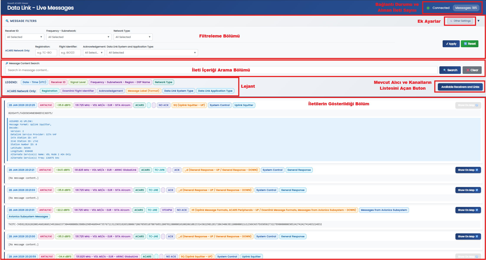

---

### Arayüz Öğeleri (Geçmiş Mod):  
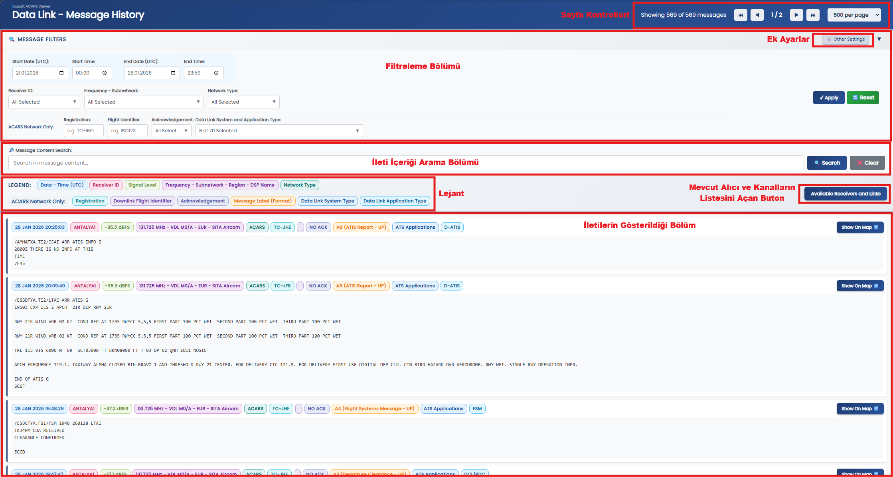

---

### Bağlantı Durumu ve Alınan İleti Sayısı (Canlı Mod):  
Bu kısımda arka yazılımla olan bağlantı durumu ve alınan ileti sayısı gösterilir.
* **Connected**: Arka yazılımla bağlantı kurulmuş ve arka yazılımın kendisi, Data Link besleme yazılımı veya yönlendiricisine bağlanmış.
* **Disconnected**: Arka yazılımla bağlantı kurulmamış veya arka yazılımla bağlantı kurulmuş fakat arka yazılımın kendisi, Data Link besleme yazılımı veya yönlendiricisine bağlanmamış.

---

### Sayfa Kontrolleri (Geçmiş Mod):  
Sayfada kaç ileti gösterileceği seçilebilir ve sayfa değiştirilebilir. Toplam sonuç sayısı da gösterilir.

---

### Filtreleme Bölümü:  
Filtreleme bölümü, iletileri çeşitli kriterlere göre filtrelemeye olanak sağlar. Sağ üst köşedeki küçük üçgene tıklanarak daraltılabilir veya genişletilebilir.  

**Other Settings:**  
Diğer ayarlar bölümünü açar/kapatır. Diğer ayarlardaki "Display only the completed version of multi-block messages" seçeneği işaretlenirse (varsayılan olarak seçili), çok bloklu iletilerin sadece tamamlanmış halleri gösterilir. İşaretlenmezse, çok bloklu iletilerin tüm blokları ayrı ayrı gösterilir, birleştirilmiş hali de gösterilir.  
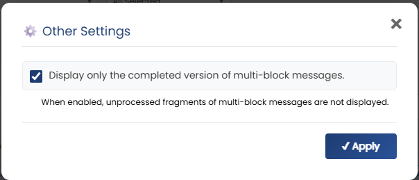  

**Tarih - Zaman Aralığı (Sadece geçmiş mod):**  
Belirtilen tarih ve zaman aralığında iletiler filtrelenir. (UTC)
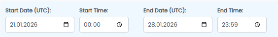  

**Receiver ID**:  
Belirtilen alıcı kimliğine göre iletiler filtrelenir.  
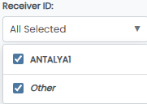  

**Frequency / Subnetwork:**  
Belirtilen frekans ve/veya subnetwork türüne göre iletiler filtrelenir. Bu bölüm, ayarlar bölümünde anlatılan liste ayarlarına bağlıdır.  
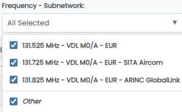  

**Network Type:**  
ACARS, ATN ve Diğer olarak iletiler filtrelenir. (ATN seçeneği henüz desteklenmemektedir.)  
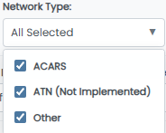

**ACARS Network Only Filtreler:**  
Bu filtreleme özellikleri, Network Type filtresi ACARS seçildiyse etkinleşir.  
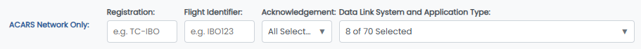  

* **Registration:** ARINC 618'de Aircraft Address (ICAO 24 bit Aircraft Address ile alakalı değildir.) olarak da belirtilen, genellikle kuyruk numarası bilgisidir.  

* **Flight Identifier:** ARINC 618'de Flight Identifier olarak belirtilen, genellikle uçuş numarası bilgisidir.  

* **Acknowledgement:** İletinin Acknowledgement durumu.  
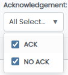  

* **Data Link System and Application Type:** ICAO Doc 10037 ve ARINC 620 de belirtilen ACARS Application ana başlıklarına göre (ICAO Doc 10037'de Data Link System Type olarak tanımlanmıştır.) ve bu başlıkların alt elemanlarına göre (ACARS Application / Operation Type) göre iletiler filtrelenebilir.  
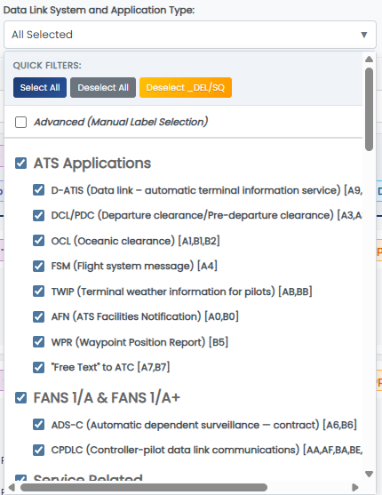  

  * Quick Filters: Select All, tüm filtreleri seçer; Deselect All, tüm filtreleri temizler; Deselect _DEL/SQ, çok sık kullanılan ve işlevsel bilgi sağlamayan _DEL ve SQ Label'li iletilerin seçimini kaldırır.  

  * Advanced (Manual Label Selection): İletilerin Label bilgisine göre elle seçim yapılabilir.  
  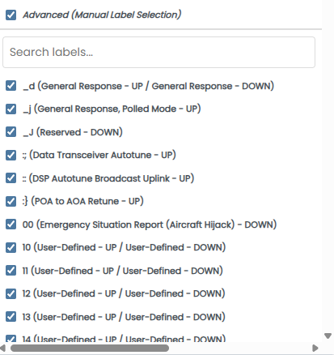  

İletiler şu ana başlıklara (System Type) göre sınıflandırılmıştır:  
  * ATS Applications: ARINC 620 ATS Applications / ICAO Doc 10037 ACARS ATS altındaki Application türlerini içerir. Aynı Application'la alakalı Label'ler gruplanmıştır.  
    

  * FANS 1/A & FANS 1/A+: ICAO Doc 10037'de FANS 1/A ve FANS 1/A+ System Type altında belirtilen Application türlerini içerir. Aynı Application'la alakalı Label'ler gruplanmıştır.  
  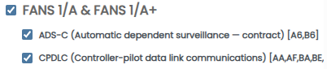  

  * Service Related: ARINC 620'de Service Related başlığı altında belirtilen Application türlerini içerir. Benzer konu ile alakalı Application'lar gruplanmıştır.  
  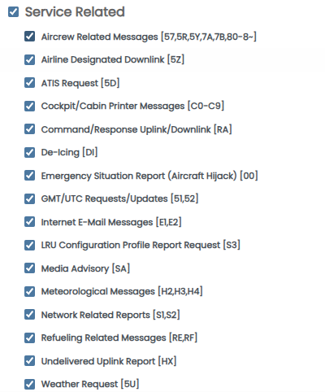  

  * Service Related - OOOI: ARINC 620'de Service Related başlığı altında belirtilen, Q ile başlayan Label'e sahip ve genelde OOOI işlevleri için kullanılan Application türlerini içerir.  
    
  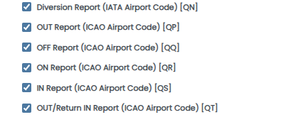  

  * Diğer bazı Başlıklar: ARINC 620'de belirtilen, bu başlıklar altındaki iletilerin pek alt dalı olmayan Ana başlıklar tekli seçenekeler olarak sunulmuştur.  
  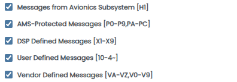  

  * System Control: ARINC 620'de System Control başlığı altında belirtilen Application türlerini içerir.  
  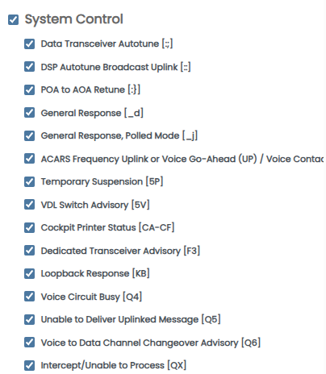  
  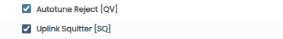

---

### Message Content Search:  
* Mesaj içeriğinde arama yapılabilir. Girilen metin, ham ileti içeriğinde aranır ve bulunan iletiler gösterilir. Büyük/küçük harf duyarlılığı yoktur.


---

### Lejant Bölümü:  
Mesaj kutularında kullanılan etiketlerin renkleri ve anlamları gösterilir.  
  

**Tüm Ağ Türlerinde Görünen Etiketler:**  
- **Date - Time (UTC)**: UTC formatında tarih ve saat
- **Receiver ID**: Alıcı istasyon kimliği  
- **Signal Level**: Sinyal seviyesi (dBFS cinsinden)
- **Frequency - Subnetwork - Region - DSP Name**: Frekans bilgisi ve açıklaması (Ayarlar bölümündeki liste ayarları ile ilişkili.)
- **Network Type**: Ağ türü (ACARS, ATN, Other)

**Sadece ACARS Ağı İletilerinde Görünen Etiketler:**  
- **Registration**: Aircraft Address (Genellikle tescil kodu.)
- **Downlink Flight Identifier**: Downlink Flight Identifier (Genellikle uçuş numarası.)
- **Acknowledgement**: ACK durumu (ACK/NO ACK)
- **Message Label (Format)**: ACARS İleti Label, Format, Labele göre yön açıklaması. (Bir label, hem Uplink biçimi hem Downlink biçimine sahipse her iki durumdaki ismi de belirtilir.)
- **Data Link System Type**: ACARS System Type (Filtrelerdeki ana başlıklar.)
- **Data Link Application Type**: ACARS Application Type (Filtrelerdeki alt seçenekler.)

---

**Available Receivers and Links Butonu:**  
Alıcı istasyonları ve bu istasyonlarda mevcut olan Data Link bağlantı türleri hakkında bilgi veren bir açılır kutuyu gösterir. Bu kutunun içeriğinin nasıl ayarlanacağı, ayarlar bölümünde anlatılmıştır. Örnek:  
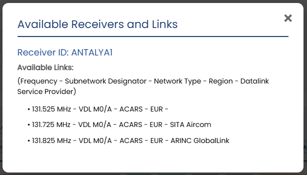

---

### İletilerdeki Show On Map Butonu:
Eğer ileti içerisinde Aircraft Address (Kuyruk Numarası) bilgisi varsa, bu buton tıklanabilir olur. Butona tıklandığında, tar1090 tabanlı uçak takip haritasında ilgili uçak gösterilecek şekilde url ve tar1090 Query String'leri ayarlanır. URL yapısı, ayarlardan ayarlanır.  
  
* Canlı modda oluşturulan URL örneği:  
`https://atc.ibosoft.net.tr/surveillance/?reg=TCOHF&noIsolation`
* Geçmiş modda oluşturulan URL örneği:  
`https://atc.ibosoft.net.tr/surveillance/?reg=TCOHF&showTrace=2026-01-28&timestamp=1769637420&zoom=7.5`

---

### İleti Örneği:
* Çözümlenmeyen ileti örneği:  
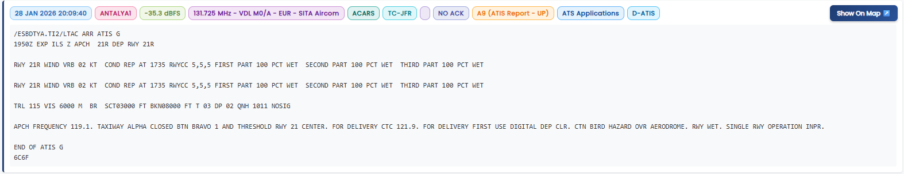  

* Çözümlenen ileti örneği:  
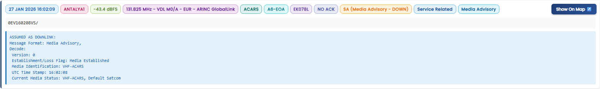  

---

## Dosya Yapısı:

```
acars-viewing-software/
├── acars-decoding-library/     # Ibosoft ACARS Decoding Library. (Projeye dahil değil, kurulum bölümüne bakınız.)
│   ├── (Alt dosyalar ve dizinler)
├── page-data-link.php          # Ana görüntüleme sayfası
├── page-data-link-style.php    # CSS stil dosyası
├── data-link-config.php        # Yapılandırma dosyası
├── load-message-labels.php     # Label yükleme modülü
├── data/                       # Yapılandırma verileri klasörü
│   ├── receiver-list.php       # Alıcı listesi
│   ├── channel-list.php        # Kanal listesi
│   └── receiver-info-config.php # Bilgi kutusunun içeriğinin yapılandırması
├── readme-assets/              # README görselleri klasörü
│   ├── image.png
│   ├── image-1.png
│   └── ...
├── LICENSE                     # Lisans dosyası
└── README.md                   # Bu dosya
```

---

# ENGLISH VERSION


## Installation and Running:

### Requirements:
- Web server (Apache, Nginx, IIS, etc.)
- PHP 8.x
- Ibosoft ACARS Backend software
- Ibosoft ACARS Decoding Library
- MySQL-based database access (for historical messages)

---

### Installation:

This software is designed as a PHP module and must be integrated into an existing website. You can create a website as you wish and call it from an appropriate page on your website. Some example steps are given below:

1. **File Placement**: Upload all files to a subdirectory you created for the Data Link viewing page in your site's directory on your web server.

2. **Adding ACARS Decoding Library**: Download the latest version of Ibosoft ACARS Decoding Library and place it in a folder named `acars-decoding-library` in this project's directory.

3. **Site Integration**: Simple index.php example to call ACARS Viewer from your main site:

```php
<?php
// Simple index.php example
?>
<!DOCTYPE html>
<html>
<head>
    // Page header information
</head>
<body>
    <?php include 'page-data-link.php'; ?>
</body>
</html>
```

4. **Database Configuration**: In history message mode, historical messages are retrieved directly from the database. The database recorded by the backend software must be used. Database connection information is taken as environment variables. You can use one of the following methods:

**Method A - Setting from within PHP:**
```php
<?php
// Create config-local.php file
putenv('DB_HOST=localhost');
putenv('DB_PORT=3306');
putenv('DB_NAME=acars_database');
putenv('DB_USER=username');
putenv('DB_PASS=password');

// Include this file at the beginning of your main page
include 'config-local.php';
include 'page-data-link.php';
?>
```

**Method B - Setting via Apache .htaccess:**
```apache
# .htaccess file
SetEnv DB_HOST "localhost"
SetEnv DB_PORT "3306"
SetEnv DB_NAME "acars_database"
SetEnv DB_USER "username"
SetEnv DB_PASS "password"
```

5. **Backend Settings**: Make the settings specified in the backend software's README file, and make the settings related to the backend software in the client software in a compatible manner.

6. **Web Server Check**: Make sure the PHP module is active

---

### Running:
When you log in to the page that calls this module on your site in your browser, the ACARS Viewer interface will open.

---

## Settings:

### Backend Connection:
Configure the connection settings in the `data-link-config.php` file according to the backend software settings:

```php
// API URLs
define('DATALINK_API_HOST', 'dlink-api.ibosoft.net.tr'); // Backend API host name/IP
define('DATALINK_API_PORT', 2053); // Backend API port number
define('DATALINK_API_BASE_URL', 'https://' . DATALINK_API_HOST . ':' . DATALINK_API_PORT); // http/https setting
```

---

### Surveillance Map Integration:
URL settings required for aircraft tracking map (tar1090) integration. If the Aircraft Address information in ACARS messages contains a tail number, appropriate tar1090 query strings are added to the end of the URL by the software and a clickable button appears at the edge of the message.

**For Live Mode:**
```php
// Surveillance map URL in live mode
define('SURVEILLANCE_MAP_BASE_URL', 'https://atc.ibosoft.net.tr/surveillance/');
define('SURVEILLANCE_MAP_URL_QUERY', '?reg={REG}&noIsolation');
```

**For History Mode:**
```php
// Surveillance map URL in history mode
define('SURVEILLANCE_MAP_BASE_URL_HISTORY', 'https://atc.ibosoft.net.tr/surveillance/');
define('SURVEILLANCE_MAP_URL_QUERY_HISTORY', '?reg={REG}&showTrace={DATE}&timestamp={TIMESTAMP}&zoom=7.5');
```

**Placeholder Explanation:**
- `{REG}`: Aircraft registration code (with dashes removed)
- `{DATE}`: Date information (in Y-m-d format UTC)
- `{TIMESTAMP}`: Time information in Unix timestamp format

**URL Examples to be Created:**
- Live mode: `https://atc.ibosoft.net.tr/surveillance/?reg=TCOHF&noIsolation`
- History mode: `https://atc.ibosoft.net.tr/surveillance/?reg=TCOHF&showTrace=2026-01-28&timestamp=1769637420&zoom=7.5`

---

### Default Filter Settings:
Determines which labels will be selected when the page loads:
* true: All Labels selected
* false: All Labels selected except _DEL and SQ Labels (ACARS message formats with these two Labels are used very frequently and do not provide functional information. Therefore, you may want them to be unselected at initial loading.)

For example, you can set all labels selected for liveness tracking in live mode; however, in history mode, it may be preferred that all labels except these two be selected to list more functional messages directly.

```php
// Default Filter Settings
define('DEFAULT_SELECT_ALL_LABELS_LIVE', true);     // Live mode: ALL labels selected
define('DEFAULT_SELECT_ALL_LABELS_HISTORY', false);  // History mode: ALL labels EXCEPT _DEL and SQ selected
```

---

### Receiver and Channel Settings:

**Receiver List (`data/receiver-list.php`)**  
This file is used for filtering and tagging. Receiver identifiers should be set according to the user's data link infrastructure. If a receiver identifier outside the list is sent, the receiver identifier is displayed directly. In filtering, all receivers outside the list are displayed with the Other option.

```php
// Sample receiver list
<?php
$RECEIVERS = [
    'ANTALYA1',
    // 'ANKARA1',
    // 'ISTANBUL1',
];
```

**Channel List (`data/channel-list.php`)**  
This file is used for filtering and tagging. It determines with which customized name a frequency will be displayed. Frequencies should be set according to the user's data link infrastructure. If frequency information outside the list is sent, the frequency number is displayed directly. In filtering, all frequencies outside the list are displayed with the Other option.

```php
// Sample channel list
<?php
$CHANNELS = [
    '131.525' => 'VDL M0/A - EUR',
    '131.725' => 'VDL M0/A - EUR - SITA Aircom',
    '131.825' => 'VDL M0/A - EUR - ARINC GlobalLink',
];
```

**Receiver Info Box (`data/receiver-info-config.php`) - Optional**  
Sets the content of the info box that opens when the "Available Receivers and Link" button is clicked. It can be customized with HTML and CSS optionally.

```php
<script>
const RECEIVER_INFO = `
<h2>Available Receivers and Links</h2>

<div class="receiver-section">
    <h3>Receiver ID: ANTALYA1</h3>
    <h4>Available Links:</h4>
    <p>(Frequency - Subnetwork Designator - Network Type - Region - Datalink Service Provider)</p>
    <ul class="frequency-list">
        <li>• 131.525 MHz - VDL M0/A - ACARS - EUR - </li>
        <li>• 131.725 MHz - VDL M0/A - ACARS - EUR - SITA Aircom</li>
        <li>• 131.825 MHz - VDL M0/A - ACARS - EUR - ARINC GlobalLink</li>
    </ul>
</div>
`;
</script>
```

---

### Other Settings:
```php
// Message Display Limits
define('MAX_DISPLAY_MESSAGES', 1000);        // Maximum number of messages to display in live mode. If this number is exceeded, the oldest messages start to be deleted.
define('HISTORY_QUERY_LIMIT', 5000);         // Determines the maximum number of messages that can be pulled in a single query in history mode. If this number is exceeded according to the selected filter criteria, a "Show more messages" button appears at the end. When pressed, this many messages are pulled again and a button is displayed again depending on the situation.
define('HISTORY_MESSAGES_PER_PAGE', 500);    // Default number of messages per page in history mode.

// Decoder Configuration
define('DECODER_MAX_RETRIES', 3);            // Number of decoder API attempts for ARINC 622 applications, if this number is exceeded, ARINC 622 decoding is stopped. Refer to the relevant section.
define('DECODER_TIMEOUT_MS', 10000);         // Decoder API timeout in milliseconds (10 seconds)
define('DECODER_RETRY_DELAY_MS', 1000);      // Delay between retries in milliseconds (1 second)

// Health Check Configuration
define('HEALTH_CHECK_INTERVAL_MS', 5000);    // Backend health check interval for live mode (5 seconds). Connected/Disconnected status is updated accordingly.
```

> **NOTE:** Other settings (Label - group mappings) have not been added for modification purposes.

---

## Some Issues Related to Software Operation:

### Data Link Network Type Detection:
In Data Link messages, network type (ACARS/ATN) tagging and filtering is done according to the `name` information under `app` in the JSON information coming to the backend software. Distinction is made according to which network type the feeder software used decodes.

Messages with the following 'name' values are considered ACARS network messages:
* acarsdec
* vdlm2dec
* dumphfdl
* jaero

ATN network is not yet supported.

---

### About Decoding and Classification of ACARS Network Messages:
* Classification processes in filtering and tagging are done according to the information in the CSV file within the Ibosoft ACARS Decoding Library. Messages that can be decoded within the scope of ARINC 620 are also selected according to the decodability status in the CSV.
* Processing of multi-block messages must be done by feeder or routing software. Neither the client nor the backend software has such a function.
* The decoded version of decodable messages is displayed in an additional box under the raw message. Decoding is not done for messages not supported by libraries, some messages readable by humans, and some message types that do not have content.
* Since direction detection (Uplink / Downlink) of messages cannot be made, for messages within the scope of ARINC 620:
  * If the relevant message Label is only for Uplink, it is indicated in the decoded message box with the statement 'ASSUMED AS UPLINK'.
  * If the relevant message Label is only for Downlink, it is indicated in the decoded message box with the statement 'ASSUMED AS DOWNLINK'.
  * If the relevant message Label is for both Uplink and Downlink, first the decoded expression assuming the message is uplink with the statement 'ASSUMED AS UPLINK', then the decoded expression assuming the message is downlink with the statement 'ASSUMED AS DOWNLINK' is displayed.
* For messages with AA (CPDLC), BA (CPDLC), A6 (ADS-C), B6 (ADS-C), MA (MIAM), H1 Labels within the scope of ARINC 622, the direction detection process is left to the relevant library. The result given by the library is displayed as is.
* Decoding of messages within the scope of ARINC 620 is done by the client software with Ibosoft ACARS Decoding Library.
* While decoding ARINC 622 applications, for live messages, if the message is an ACARS network message and the message Label is AA (CPDLC), BA (CPDLC), A6 (ADS-C), B6 (ADS-C), MA (MIAM), H1, the message is decoded in the backend software and transmitted to the client software with live message information.
* In historical messages, since the client software accesses the database directly via PHP, it does not use the backend software directly. Since ARINC 622 applications are decoded on the backend software side, an API endpoint has been added to the backend software. When the client software wants to decode ARINC 622 applications for historical messages, it sends a request to the backend software and the backend software decodes the message and transmits the result to the client software. For this function, the message must be an ACARS network message and the message Label must be AA (CPDLC), BA (CPDLC), A6 (ADS-C), B6 (ADS-C), MA (MIAM), H1.
* If there is a problem with API access while decoding ARINC 622 applications, after several attempts, the expression `[decoding-error]` is displayed in the decoded result of messages decoded within this scope. Decoding of messages within the scope of ARINC 620 continues.
* While decoding ARINC 622 applications, if a message is received in a format not covered by the library in the backend software, the expression `[No decoding available.]` is displayed for this message.
* When decodable messages within the scope of ARINC 620 and 622 are attempted to be decoded, if the libraries themselves produce an error message, these error messages are displayed.

---

## Interface Usage and Features:

### Interface Elements (Live Mode):  

---

### Interface Elements (History Mode):  

---

### Connection Status and Number of Received Messages (Live Mode):
This section shows the connection status with the backend software and the number of messages received.
* **Connected**: Connection with backend software established and the backend software itself connected to the Data Link feeder software or router.
* **Disconnected**: Connection with backend software not established or connection with backend software established but the backend software itself not connected to the Data Link feeder software or router.

---

### Page Controls (History Mode):
You can select how many messages will be displayed on the page and change pages. The total number of results is also displayed.

---

### Filtering Section:
The filtering section allows filtering messages according to various criteria. It can be collapsed or expanded by clicking the small triangle in the upper right corner.

**Other Settings:**
Opens/closes the other settings section. If the "Display only the completed version of multi-block messages" option in other settings is checked (selected by default), only the completed versions of multi-block messages are displayed. If not checked, all blocks of multi-block messages are displayed separately, and the combined version is also displayed.


**Date - Time Range (History mode only):**
Messages are filtered in the specified date and time range. (UTC)  

Messages are filtered according to the specified receiver identifier.  

Messages are filtered according to the specified frequency and/or subnetwork type. This section depends on the list settings explained in the settings section.  

Messages are filtered as ACARS, ATN and Other. (ATN option is not yet supported.)  

These filtering features are enabled if the Network Type filter is set to ACARS.  


* **Flight Identifier:** Specified as Flight Identifier in ARINC 618, usually flight number information.  

* **Acknowledgement:** Acknowledgement status of the message.  

* **Data Link System and Application Type:** Messages can be filtered according to ACARS Application main headings specified in ICAO Doc 10037 and ARINC 620 (defined as Data Link System Type in ICAO Doc 10037) and according to sub-elements of these headings (ACARS Application / Operation Type).  

  * Quick Filters: Select All selects all filters; Deselect All clears all filters; Deselect _DEL/SQ removes the selection of messages with _DEL and SQ Labels that are used very frequently and do not provide functional information.  

  * Advanced (Manual Label Selection): Manual selection can be made according to the Label information of messages.  
  
Messages are classified according to the following main headings (System Type):
  * ATS Applications: Includes Application types under ARINC 620 ATS Applications / ICAO Doc 10037 ACARS ATS. Labels related to the same Application are grouped.  
  
  * FANS 1/A & FANS 1/A+: Includes Application types specified under FANS 1/A and FANS 1/A+ System Type in ICAO Doc 10037. Labels related to the same Application are grouped.  
  
  * Service Related: Includes Application types specified under the Service Related heading in ARINC 620. Applications related to similar topics are grouped.  
  
  * Service Related - OOOI: Includes Application types specified under the Service Related heading in ARINC 620, with Labels starting with Q and generally used for OOOI functions.  
  
  
  * Some Other Headings: Main headings specified in ARINC 620, whose messages under these headings do not have many sub-branches, are presented as single options.  
  
  * System Control: Includes Application types specified under the System Control heading in ARINC 620.  
  
  
---

### Message Content Search:
* Search can be done in message content. The entered text is searched in the raw message content and found messages are displayed. There is no case sensitivity.  


### Legend Section:
Colors and meanings of tags used in message boxes are displayed.  

- **Date - Time (UTC)**: Date and time in UTC format
- **Receiver ID**: Receiver station identifier
- **Signal Level**: Signal level (in dBFS)
- **Frequency - Subnetwork - Region - DSP Name**: Frequency information and description (related to list settings in the settings section.)
- **Network Type**: Network type (ACARS, ATN, Other)

**Tags Shown Only for ACARS Network Messages:**
- **Registration**: Aircraft Address (Usually registration code.)
- **Downlink Flight Identifier**: Downlink Flight Identifier (Usually flight number.)
- **Acknowledgement**: ACK status (ACK/NO ACK)
- **Message Label (Format)**: ACARS Message Label, Format, direction description according to Label. (If a label has both Uplink and Downlink format, both names are specified.)
- **Data Link System Type**: ACARS System Type (Main headings in filters.)
- **Data Link Application Type**: ACARS Application Type (Sub-options in filters.)

---

**Available Receivers and Links Button:**
Displays a pop-up box that provides information about receiver stations and Data Link connection types available at these stations. How to set the content of this box is explained in the settings section. Example:  


### Show On Map Button in Messages:
If there is Aircraft Address (Tail Number) information in the message, this button becomes clickable. When the button is clicked, the url and tar1090 Query Strings are set to display the relevant aircraft on the tar1090-based aircraft tracking map. URL structure is set from settings.

* URL example created in live mode:
`https://atc.ibosoft.net.tr/surveillance/?reg=TCOHF&noIsolation`
* URL example created in history mode:
`https://atc.ibosoft.net.tr/surveillance/?reg=TCOHF&showTrace=2026-01-28&timestamp=1769637420&zoom=7.5`

---

### Message Example:
* Undecoded message example:  


* Decoded message example:


## File Structure:

```
acars-viewing-software/
├── acars-decoding-library/     # Ibosoft ACARS Decoding Library. (Not included in project, see installation section.)
│   ├── (Subfiles and directories)
├── page-data-link.php          # Main viewing page
├── page-data-link-style.php    # CSS style file
├── data-link-config.php        # Configuration file
├── load-message-labels.php     # Label loading module
├── data/                       # Configuration data folder
│   ├── receiver-list.php       # Receiver list
│   ├── channel-list.php        # Channel list
│   └── receiver-info-config.php # Configuration of info box content
├── readme-assets/              # README images folder
│   ├── image.png
│   ├── image-1.png
│   └── ...
├── LICENSE                     # License file
└── README.md                   # This file
```

---
